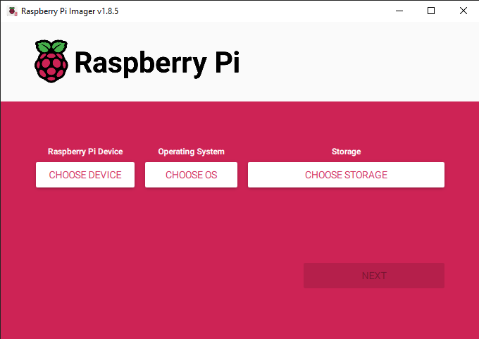
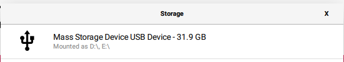
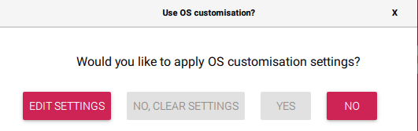
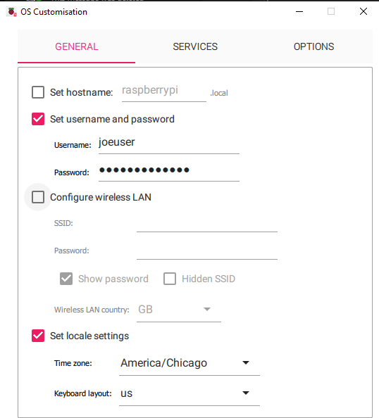
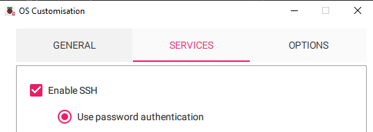

# Imaging the SD card

1. Put the Micro SD card into the USB adapter and insert it into the lab computer
2. Start Raspberry Pi Imager
   
   

2. Click Choose Device and pick Raspberry Pi 4
3. Click on Choose OS and pick Raspberry Pi OS (64-bit)
4. Click on Choose Storage and pick the SD card. It'll probably be the only thing in the list and should look like this.

    

    If you see more than one option, be **REALLY CAREFUL** to pick the right one. It shouldn't let you, but it's possible to wipe the main drive if it shows up. 

5. Click on Next
6. You'll be prompted to apply custom settings. Yes, you want to so click on Edit Settings. 
7. 
    

8. On the General tab, check for `Set username and password`. They can be whatever you want and you can add more users later if you want to. Also check `Set local settings` and pick `America/Chicago` as the timezone and `us` for the keyboard layout.
9. 
    

10. On the services tab click `Enable SSH` and `use password authentication`. 

    

11. Click on `Save`
12. You'll be back at the "Would you like to apply OS customization settings?" window. Click `Yes`. 
13. You'll probably get a warning that all data on the card will be wiped. That's okay, it's what we want.
14. Go get some coffee or tea. It takes a while to reimage the card.
