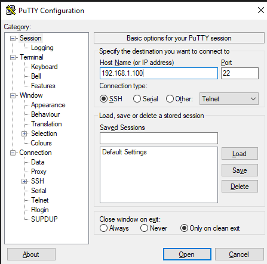
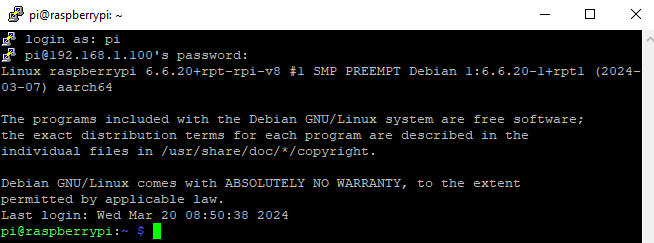
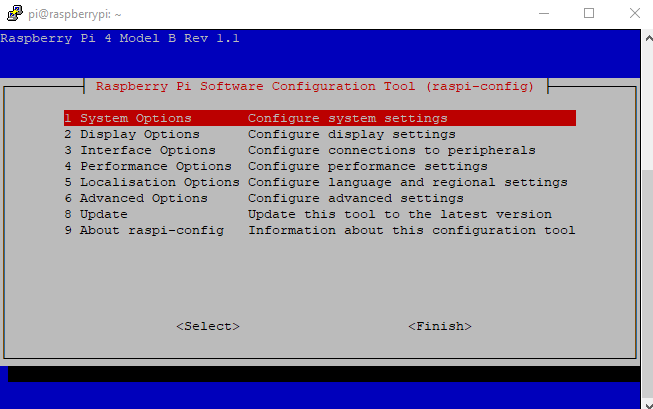
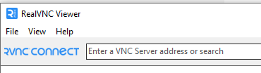
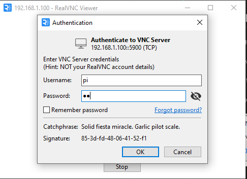
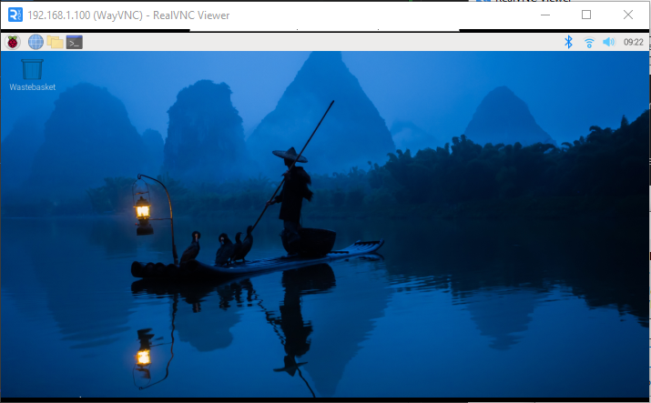

# First Boot

Plug in the ethernet cable to the Pi and the dongle.

Plug power into the Pi, either the USBc to USBc adapter from the box we just got or the power adapter from the CanaKit. 

The Pi should start flashing. Give it a bit to boot and then load up PuTTY or your favorite SSH client if you're nerdy enough to have a favorite SSH client. (Yes, I have a favorite, and it's not PuTTY)

> Side note. Don't forget to put the micro SD card into the Pi before turning it on. May be speaking from experience here. 

## PuTTY

Start up PuTTY and enter the IP address of the Pi into the box. Leave everything else as-is and click Open.



You'll probably get a message about an unknown host key. Just accept it. It's a security warning to make sure you're connecting to the device you think you are. 

Next you'll see a login prompt. Enter the username and password you entered when you create the image a few steps ago. 



## Initial Config

From the terminal type `sudo raspi-config` and you should see the following screen.



Scroll down to `Localization Options` and then pick `Timezone`. Screen will flash and we want to make sure we're set to `Americas` and then `Chicago` since they're in the same timezone as Houston. 

This may already be set since we did it on the Image options earlier, but it isn't always. 

Back to the main screen and pick `System Options` and then `Wireless LAN`.

Enter `KISDBeTheLegacy` for the SSID and `bethelegacy` for the password. Enter to save and head back to the main screen when it's done. 

Save and exit back to the command prompt. 

## Setting the date

No clue why, but every Raspi I've ever setup has had the date 3 or 4 days off when it first booted. We've got to fix that. At the terminal type

```
sudo date -s "Wed March 20 08:00:00 America/Chicago"
```

Press enter and it should set the time. Of course, replace the date and time with whatever the actual time is. 

## More config

Back to `sudo raspi-config`

This time `Interface Options` and then `VNC` and enable it. This will allow you to login with a GUI later. If you're never going to have your students use the GUI you can skip this step.

Back home, and then `Advanced Options`. Pick `Expand Filesystem`. When imaged the SD card is sized to about 512mb, no matter how big the SD actually is. This command resizes it to use the full space the next time you boot. 

## Real VNC

If you're going to have your students stay at the command line and never use the GUI you can skip this step.

Fire up RealVNC Viewer.

It's going to prompt you for a username and password but I was able to skip that without having to enter anything.

It's then going to prompt for an address. Enter the IP of the Pi into the field and hit enter.



You'll probably get a warning similar to the first time you logged in with PuTTY. Nothing to worry about. Just continue.

It'll prompt you for a login. Same one as you used in PuTTY. 



Give it a second and you should see the GUI for your Pi.


