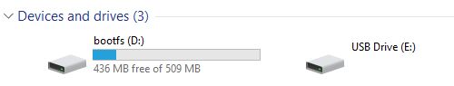

# Setting the IP Address on the Pi

We're creating a 2 device wired network between the lab computer and the Raspberry Pi and will enable Wi-Fi on the Pi in a couple of steps so it can get to the internet. 

After the imaging is finished you should see two drives on your computer, one called `bootfs` and one without a name. 



Open up the `bootfs` drive, probably `D:\` and then open up the file `cmdline.txt`

Lots of mess there that we don't want to touch or the Pi won't boot. Should look something like this, but all on one line.

```
console=serial0,115200 console=tty1 root=PARTUUID=ba3e4f3d-02 rootfstype=ext4 fsck.repair=yes rootwait quiet splash plymouth.ignore-serial-consoles
```

We need to add a fixed IP address to the end of that line, making sure it stays on one line.

What you're adding will look like this.

```
ip=192.168.1.100::169.254.1.1:255.255.255.0:rpi:eth0:off
```

The first address, `192.168.1.100` is the IP address you're giving to this pi. It should start with `192.168.1`. The last octet can be anything between 2 and 254. If you're not ever going to network Pis together you can use the same address for them. 

What I'm doing is using `1xx` for all of mine, with `xx` matching the computer number that Pi is getting used at. So seat 1 will be `192.168.1.101`, seat 2 will be `192.168.1.102` and so on. I'm using the `2xx` range for the desktops in the steps on the next page. 

> A nerdy aside. 
>    
> The second address is the gateway address. It's not getting used, and is intionally in an error subnet to make it stand out. The third address is the subnet mask.

When you're done the file should look like this, again all one one line and with whatever IP you picked for the first one. 

```
console=serial0,115200 console=tty1 root=PARTUUID=ba3e4f3d-02 rootfstype=ext4 fsck.repair=yes rootwait quiet splash plymouth.ignore-serial-consoles ip=192.168.1.100::169.254.1.1:255.255.255.0:rpi:eth0:off
```

Save the file, pull the SD card from your computer, and put it into the Pi. We have to [setup the lab computer](./labnetwork.md) before we can boot the Pi. 
