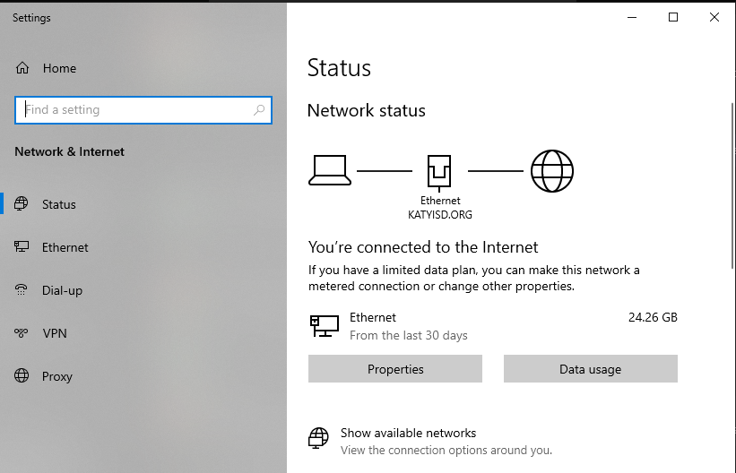
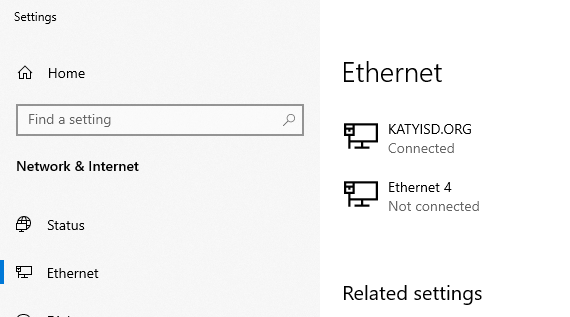
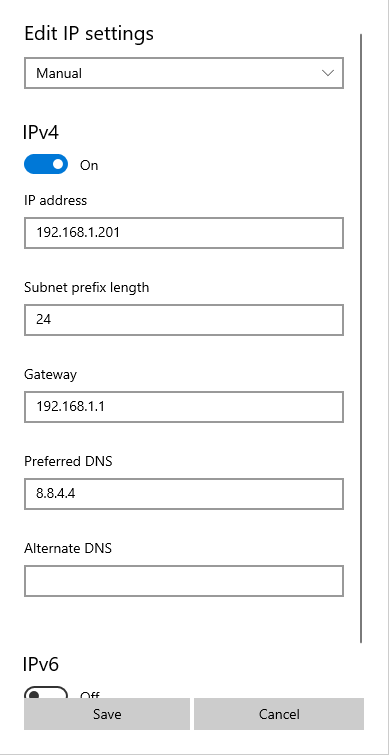

# Setting up the lab computer

Take out the USB Ethernet dongle and plug it into the lab computer. With luck you should hear a little chirp as Windows automatically installs the driver for you. 

Right click on the network icon in the system tray (down by the clock) and pick `Open network and internet settings`. That should bring up a screen that looks similar to this. 

Click on the Ethernet tab on the left side. Should see something like this.

You should see one that says `KATYISD.ORG` and another one `Ethernet X`. 

The `Ethernet X` on is the USB dongle. 

Look under IP settings and click on the Edit button. It's probably set to `Automatic (DHCP)` and we don't want that. 

Click on the switch under IPv4 to turn it on.

IP address needs to be something in the same subnet you're using for the Pis. This is a screenshot from lab computer #1, so I'm using the address `192.168.1.201`. Subnet prefix length is 24. Gateway is `192.168.1.1` and DNS isn't really needed, but I put a Google DNS server `8.8.4.4` when I setup mine. 

Click Save.

Time to [boot the Pi for the first time](./firstboot.md).